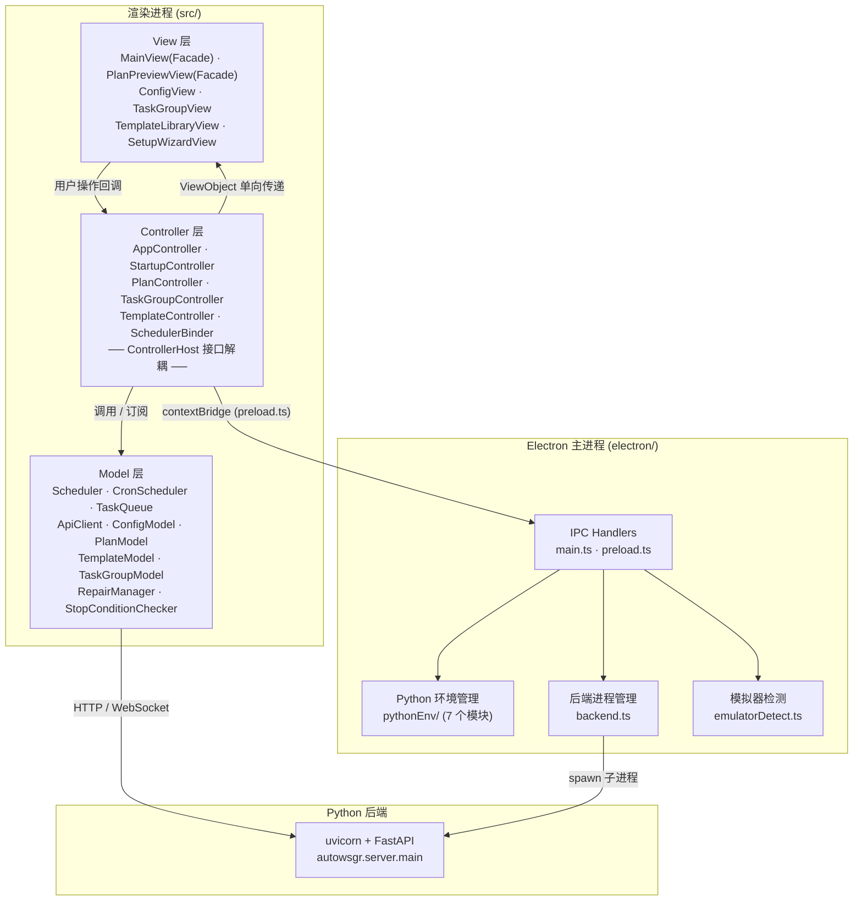
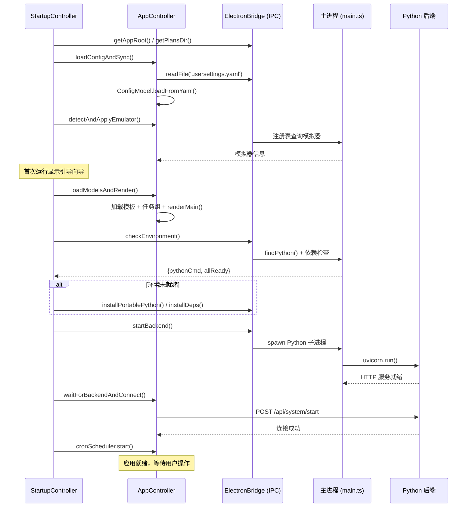

# AutoWSGR-GUI 总架构文档

## 项目简介

AutoWSGR-GUI 是一个基于 **Electron** 的桌面应用，为 [AutoWSGR](https://github.com/huan-yp/Auto-WSGR)（战舰少女R 自动化框架）提供图形化操作界面。

- **前端**：TypeScript，经典 MVC 架构，esbuild 打包
- **后端**：Python FastAPI + uvicorn，由 Electron 主进程作为子进程管理
- **通信**：Electron IPC（主进程 ↔ 渲染进程）+ HTTP/WebSocket（渲染进程 ↔ Python 后端）

---

## 整体分层架构



### 分层职责

| 层 | 位置 | 职责 |
|----|------|------|
| **View** | `src/view/` | 纯 UI 渲染，接收 ViewObject 显示；不含业务逻辑。大型视图采用 Facade 模式内部拆分 |
| **Controller** | `src/controller/` | 从 Model 提取数据 → 拼装 ViewObject → 调用 View 渲染；处理用户事件 → 调用 Model / IPC。通过 ControllerHost 接口解耦 |
| **Model** | `src/model/` | 业务实体 + 领域服务：调度、配置、方案解析、后端通信 |
| **Types** | `src/types/` | 跨层共享的 TypeScript 类型定义，按领域拆分为 5 个文件 |
| **主进程** | `electron/` | 窗口管理、IPC handler、Python 环境发现/安装、后端子进程生命周期、模拟器检测 |
| **Python 后端** | 外部 | 游戏自动化核心逻辑：模拟器连接、战斗执行、OCR 识别 |

---

## 目录结构

```
AutoWSGR-GUI/
├── electron/                   # Electron 主进程
│   ├── main.ts                 # 入口：窗口创建、IPC handler 注册
│   ├── preload.ts              # contextBridge 安全 API 暴露
│   ├── backend.ts              # Python 后端启动/停止
│   ├── emulatorDetect.ts       # 模拟器注册表检测
│   └── pythonEnv/              # Python 环境管理子模块
│       ├── context.ts          # 共享上下文与缓存状态
│       ├── finder.ts           # Python 可执行文件发现
│       ├── envCheck.ts         # 环境验证主流程
│       ├── installer.ts        # Python 安装与依赖管理
│       ├── updater.ts          # autowsgr 自动更新
│       ├── utils.ts            # 工具函数与共享接口
│       └── index.ts            # 聚合导出
├── src/                        # 渲染进程 (MVC)
│   ├── controller/             # 控制器（6 个子目录）
│   │   ├── app/                # 主控制器：AppController · ConfigController · SchedulerBinder · rendering · theme · constants
│   │   ├── startup/            # 启动流程：StartupController · connection · envAndUpdates
│   │   ├── plan/               # 方案控制器：PlanController · importExport · nodeEditor · presetFlow · rendering
│   │   ├── taskGroup/          # 任务组：TaskGroupController · addItems · contextMenu · importExport · metaLoader · queueLoader
│   │   ├── template/           # 模板：TemplateController · crud · selectors · useTemplate · wizard
│   │   └── shared/             # 共享基接口：ControllerHost · DialogHelper
│   ├── model/                  # 数据模型 + 业务服务
│   │   ├── scheduler/          # 调度子模块：Scheduler · CronScheduler · TaskQueue · ExpeditionTimer · StopConditionChecker · RepairManager
│   │   ├── ApiClient.ts        # HTTP/WebSocket 后端通信
│   │   ├── ConfigModel.ts      # 配置数据模型
│   │   ├── PlanModel.ts        # 方案解析/序列化
│   │   ├── TemplateModel.ts    # 模板管理
│   │   ├── TaskGroupModel.ts   # 任务组持久化
│   │   └── MapDataLoader.ts    # 地图数据加载与缓存
│   ├── view/                   # UI 视图（8 个子目录）
│   │   ├── main/               # 主页面 Facade：MainView · LogView · TaskQueueView · StatusBar
│   │   ├── plan/               # 方案预览 Facade：PlanPreviewView · MapView · NodeEditorView · FleetPresetView · FleetEditDialog
│   │   ├── config/             # 配置页：ConfigView
│   │   ├── taskGroup/          # 任务组：TaskGroupView
│   │   ├── template/           # 模板：TemplateLibraryView · TemplateWizardView · SelectorDialog
│   │   ├── setup/              # 初始化向导：SetupWizardView
│   │   ├── shared/             # 共享组件：ShipAutocomplete
│   │   └── styles/             # SCSS 样式（base/ · components/ · pages/）
│   ├── types/                  # TypeScript 类型定义
│   │   ├── api.ts              # API / WebSocket 通信类型
│   │   ├── electronBridge.ts   # IPC 桥接口
│   │   ├── model.ts            # 业务实体类型（PlanData 等）
│   │   ├── scheduler.ts        # 调度器公共类型
│   │   └── view.ts             # ViewObject 接口
│   ├── data/                   # 静态数据（舰船数据库）
│   └── utils/                  # 工具类（Logger）
├── resource/                   # 只读资源
│   ├── builtin_plans/          # 内置战斗方案 (.yaml)
│   ├── builtin_templates.json  # 内置模板
│   ├── maps/                   # 地图 JSON（节点坐标、连线）
│   └── images/                 # 图片资源
├── templates/                  # 用户自定义模板
├── plans/                      # 用户战斗方案目录
├── scripts/                    # 构建脚本
├── build/                      # electron-builder 配置
├── usersettings.yaml           # 用户配置文件
├── gui_settings.json           # GUI 级配置（端口等）
├── task_groups.json            # 任务组持久化
└── package.json                # 项目配置
```

---

## 启动流程



---

## 关键架构模式

### ControllerHost 依赖注入

子控制器（PlanController / TaskGroupController 等）不直接依赖 AppController，而是通过 `ControllerHost` 接口访问共享能力：

```typescript
interface ControllerHost {
  readonly scheduler: Scheduler;
  plansDir: string;
  renderMain(): void;
  switchPage(page: string): void;
}
```

各子控制器还定义自己的扩展 Host 接口（如 `StartupHost`、`TaskGroupHost`），由 AppController 实现。详见 [Controller 层](01-controller-layer.md)。

### ViewObject 单向数据传递

Controller 从 Model 提取数据，拼装为 **ViewObject**（定义在 `src/types/view.ts`），单向传递给 View 渲染。View 不直接访问 Model，保证视图层的纯净。

```
Model → Controller.extractViewObject() → ViewObject → View.render(vo)
```

### View Facade 模式

大型视图组件采用 Facade 模式：`MainView` 持有 `LogView` / `TaskQueueView` / `StatusBar`，`PlanPreviewView` 持有 `MapView` / `NodeEditorView` / `FleetPresetView`。Controller 只与 Facade 交互，无需感知内部拆分。

### 优先级任务队列

`Scheduler` 实现三级优先级队列，保证远征收取不会被用户任务阻塞：

| 优先级 | 值 | 说明 |
|--------|---|------|
| `EXPEDITION` | 0 | 最高优先级：远征收取 |
| `USER_TASK` | 10 | 用户手动添加的战斗任务 |
| `DAILY` | 20 | 定时触发的日常任务 |

### 本地 Python 隔离

所有 Python 包安装到 `{appRoot}/python/site-packages/`，不污染全局 Python 环境。通过 `.env_ready` 标记文件缓存环境状态，实现 < 100ms 的后续启动检查。

### 双层通信

- **IPC 层**：渲染进程 ↔ 主进程，用于文件 I/O、环境管理、系统对话框
- **HTTP/WS 层**：渲染进程 ↔ Python 后端，用于游戏操作和实时日志

---

## Types 层组织

类型定义从各模块提取为独立的 `src/types/` 层，按领域划分：

| 文件 | 内容 | 被谁引用 |
|------|------|----------|
| `api.ts` | API 响应、TaskRequest、WebSocket 消息类型 | ApiClient、Controller |
| `electronBridge.ts` | IPC 桥接口 `ElectronBridge` | Controller、StartupController |
| `model.ts` | 业务实体：PlanData、NodeArgs、FleetPreset、StopCondition | Model、Controller |
| `scheduler.ts` | 调度器：TaskPriority、SchedulerTask、SchedulerCallbacks | Scheduler、SchedulerBinder |
| `view.ts` | ViewObject：MainViewObject、PlanPreviewViewObject 等 | Controller → View |

---

## 子模块文档导航

| 文档 | 功能域 |
|------|--------|
| [Controller 层](01-controller-layer.md) | ControllerHost/DI 模式 · 6 个子目录结构 · StartupController 启动编排 |
| [任务调度系统](02-task-scheduling.md) | Scheduler · TaskQueue · CronScheduler · ExpeditionTimer · StopCondition · RepairManager |
| [配置系统](03-configuration.md) | ConfigModel · ConfigView · usersettings.yaml · gui_settings.json |
| [出击计划系统](04-battle-plan.md) | PlanModel · PlanController · PlanPreviewView(Facade) · MapDataLoader |
| [模板与任务组](05-template-and-taskgroup.md) | TemplateModel · TaskGroupModel · 创建向导 · 队列加载 |
| [后端通信](06-backend-communication.md) | IPC Bridge · ApiClient · REST API · WebSocket 事件 |
| [环境管理](07-environment-management.md) | Python 发现/安装 (pythonEnv/) · 模拟器检测 · 后端生命周期 |
| [开发环境搭建](08-dev-setup.md) | 依赖安装 · 开发/构建/打包命令 · SCSS 架构 · 调试技巧 |
