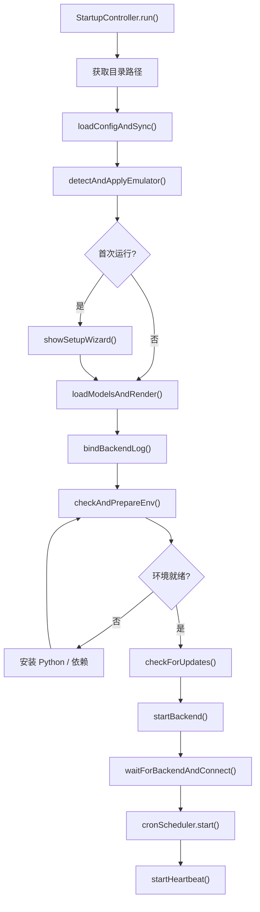
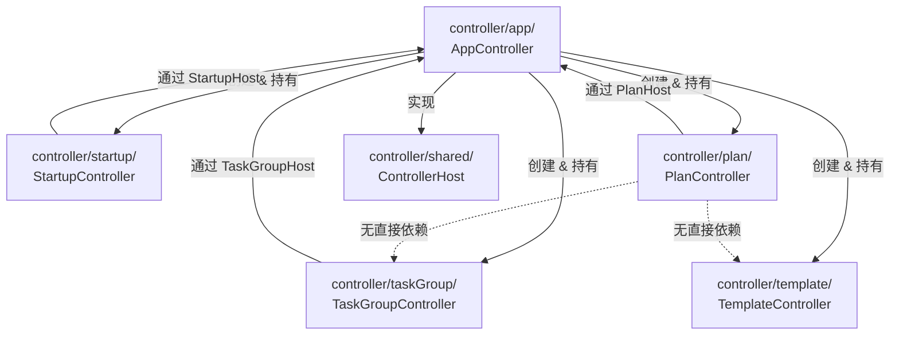

# Controller 层

> 涉及文件：`src/controller/` 全部 6 个子目录（33 个文件）

## 概述

Controller 层采用 **Host 接口依赖注入** 模式组织。`AppController` 作为唯一的根控制器，实现各子控制器定义的 Host 接口，子控制器通过 Host 访问调度器、页面切换等共享能力，避免子控制器之间的直接依赖。

每个子控制器内部进一步按职责拆分为多个模块文件，主控制器类保持精简（"瘦身版"），核心逻辑委托给同目录下的模块。

---

## ControllerHost — 基础 Host 接口

```typescript
// src/controller/shared/ControllerHost.ts
interface ControllerHost {
  readonly scheduler: Scheduler;
  plansDir: string;
  renderMain(): void;
  switchPage(page: string): void;
}
```

这是所有子控制器的最小依赖接口。各子控制器根据自身需求定义扩展的 Host 接口（如 `StartupHost`、`PlanHost`、`TaskGroupHost`），AppController 统一实现。

---

## 子目录结构

### controller/shared/ — 共享基础设施

| 文件 | 职责 |
|------|------|
| `ControllerHost.ts` | 基础 Host 接口定义 |
| `DialogHelper.ts` | 通用对话框工具（`showPrompt` / `showConfirm` / `showAlert`） |

---

### controller/app/ — 主控制器

顶层协调器，创建并持有所有子控制器实例，实现各 Host 接口。

| 文件 | 职责 |
|------|------|
| `AppController.ts` | 根控制器类：初始化子控制器、实现 Host 接口、协调全局状态 |
| `ConfigController.ts` | 配置保存逻辑：从表单收集 → 更新 ConfigModel → 同步 CronScheduler/Scheduler → 写文件 |
| `SchedulerBinder.ts` | 调度器回调绑定：将 Scheduler/CronScheduler 的回调连接到 UI 更新，管理远征/演习/战役等待中任务的 ID 跟踪 |
| `rendering.ts` | 渲染分发：构建 `MainViewObject` → 调用 `MainView.render()` |
| `theme.ts` | 主题管理：亮色/暗色/自动切换、强调色应用 |
| `constants.ts` | 常量定义 |
| `index.ts` | 聚合导出 |

**SchedulerBinder Host 接口**：

```typescript
interface SchedulerBinderHost {
  readonly scheduler: Scheduler;
  readonly cronScheduler: CronScheduler;
  readonly api: ApiClient;
  readonly templateModel: TemplateModel;
  renderMain(): void;
  updateOpsAvailability(connected: boolean): void;
}
```

---

### controller/startup/ — 启动流程

从 AppController 独立出来的启动编排控制器。

| 文件 | 职责 |
|------|------|
| `StartupController.ts` | 启动流程主编排：路径获取 → 配置加载 → 模拟器检测 → 首次引导 → 环境检查 → 后端连接 |
| `envAndUpdates.ts` | 环境检查与更新：调用 IPC `checkEnvironment()` / `installDeps()` / `checkForUpdates()` |
| `connection.ts` | 后端连接：`waitForBackendAndConnect()` 轮询等待后端 HTTP 就绪，然后发送系统启动请求 |
| `index.ts` | 聚合导出 |

**StartupHost 接口**（由 AppController 实现）：

```typescript
interface StartupHost {
  readonly scheduler: Scheduler;
  readonly cronScheduler: CronScheduler;
  readonly configModel: ConfigModel;
  appRoot: string;
  plansDir: string;
  configDir: string;
  pendingGuiVersion: string | null;

  syncPaths(appRoot: string, plansDir: string, configDir: string): void;
  initLogger(bridge: ElectronBridge): void;
  loadConfigAndSync(): Promise<void>;
  detectAndApplyEmulator(): Promise<void>;
  showSetupWizard(): Promise<void>;
  loadModelsAndRender(bridge: ElectronBridge): Promise<void>;
  bindBackendLog(bridge: ElectronBridge): void;
  renderMain(): void;
  startHeartbeat(): void;
}
```

**启动时序**：



---

### controller/plan/ — 方案控制器

管理方案的导入/导出/编辑和预览渲染。

| 文件 | 职责 |
|------|------|
| `PlanController.ts` | 方案子控制器类：持有当前方案状态，协调下属模块 |
| `importExport.ts` | 方案文件的导入/导出/新建流程 |
| `presetFlow.ts` | 任务预设的导入/查看/关闭/执行流程 |
| `nodeEditor.ts` | 节点编辑器：从 UI 收集节点阵型/夜战/索敌规则并写回 PlanData |
| `rendering.ts` | 构建 `PlanPreviewViewObject`，协调地图数据和方案数据的合并 |
| `index.ts` | 聚合导出 |

**PlanHost 接口**：

```typescript
interface PlanHost {
  readonly scheduler: Scheduler;
  plansDir: string;
  renderMain(): void;
  switchPage(page: string): void;
}
```

---

### controller/taskGroup/ — 任务组控制器

管理任务组的 CRUD、拖拽排序、队列加载。

| 文件 | 职责 |
|------|------|
| `TaskGroupController.ts` | 任务组子控制器类：绑定视图事件，协调下属模块 |
| `addItems.ts` | 向任务组添加项目：从当前方案/文件/预设添加 |
| `queueLoader.ts` | 加载任务组到调度队列：逐项构建 TaskRequest → `Scheduler.addTask()` |
| `metaLoader.ts` | 加载任务项的元数据（方案标题、模板名称）用于 UI 显示 |
| `contextMenu.ts` | 右键上下文菜单：编辑/删除/复制任务项 |
| `importExport.ts` | 任务组的导入/导出 |
| `index.ts` | 聚合导出 |

**TaskGroupHost 接口**：

```typescript
interface TaskGroupHost {
  readonly scheduler: Scheduler;
  plansDir: string;
  renderMain(): void;
  switchPage(page: string): void;
  importTaskPreset(preset: TaskPreset, filePath: string): void;
  getCurrentPlan(): PlanModel | null;
  setCurrentPlan(plan: PlanModel, mapData: MapData | null): void;
  renderPlanPreview(): void;
  closePresetDetail(): void;
  executePreset(): void;
  getCurrentPresetInfo(): { preset: TaskPreset; filePath: string } | null;
}
```

---

### controller/template/ — 模板控制器

管理模板库的 CRUD、创建向导、使用模板。

| 文件 | 职责 |
|------|------|
| `TemplateController.ts` | 模板子控制器类：绑定库视图/向导视图事件 |
| `wizard.ts` | 4 步创建向导：选类型 → 配参数 → 设默认值 → 命名确认 |
| `useTemplate.ts` | "使用模板"流程：展示选项弹窗 → 添加到任务组 / 加入队列 / 直接执行 |
| `selectors.ts` | 选择弹窗：方案选择、战役选择、舰队选择、决战章节选择 |
| `crud.ts` | 模板的编辑/删除/重命名/批量导入 |
| `index.ts` | 聚合导出 |

---

## 依赖关系



**关键设计**：Plan/TaskGroup/Template 之间没有直接依赖，需要跨子控制器协作时通过 Host 接口回调到 AppController，再由 AppController 分发。

---

## 与其他系统的关系

- **Model 层**：Controller 持有 Model 实例引用，通过 Model 的公共方法读写数据
- **View 层**：Controller 构建 ViewObject 传递给 View 渲染，View 通过回调将用户操作传回 Controller
- **IPC 层**：StartupController 和 ConfigController 通过 `window.electronBridge` 调用主进程功能
- **调度系统**：SchedulerBinder 封装 Scheduler/CronScheduler 的回调绑定；各子控制器通过 Host 的 `scheduler` 属性添加任务
