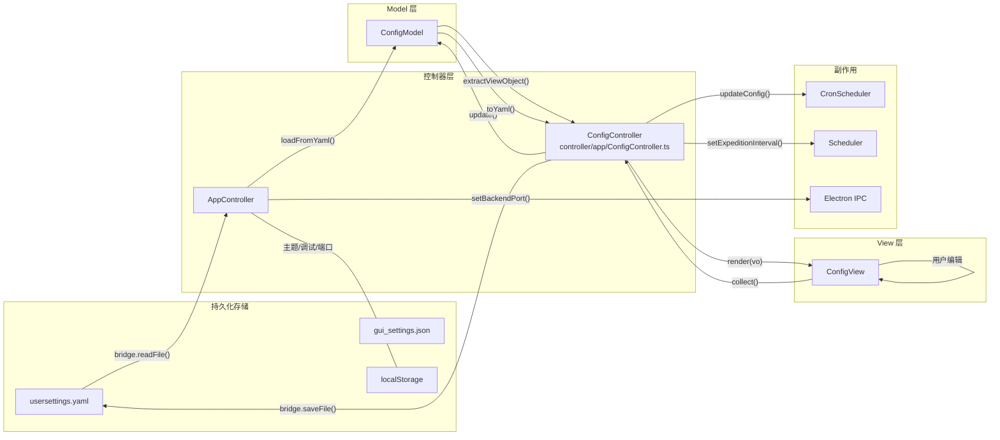

# 配置系统

> 涉及文件：`src/model/ConfigModel.ts` · `src/view/config/ConfigView.ts` · `src/controller/app/ConfigController.ts` · `src/controller/app/theme.ts` · `src/types/model.ts` · `usersettings.yaml` · `gui_settings.json`

## 概述

配置系统采用**双层存储**：

| 层级 | 文件 | 内容 | 读写方式 |
|------|------|------|----------|
| **GUI 级** | `gui_settings.json` | 后端端口、Python 路径 | Electron 主进程直接读写 |
| **用户级** | `usersettings.yaml` | 模拟器、账号、日常自动化 | 渲染进程通过 IPC 读写 |

另外，主题/调试模式等纯 UI 偏好存储在浏览器 `localStorage` 中。

---

## 数据模型

### UserSettings 结构

```typescript
interface UserSettings {
  emulator: EmulatorConfig;
  account: AccountConfig;
  daily_automation: DailyAutomation;
}
```

#### EmulatorConfig — 模拟器配置

| 字段 | 类型 | 说明 |
|------|------|------|
| `type` | `string` | 模拟器类型：`"MuMu"` / `"雷电"` / `"蓝叠"` 等 |
| `path` | `string?` | 模拟器可执行文件路径 |
| `serial` | `string?` | ADB 连接串口，如 `"127.0.0.1:16384"` |

#### AccountConfig — 账号配置

| 字段 | 类型 | 说明 |
|------|------|------|
| `game_app` | `string` | 服务器：`"官服"` 等 |
| `account` | `string?` | 账号 |
| `password` | `string?` | 密码 |

#### DailyAutomation — 日常自动化

| 字段 | 类型 | 默认 | 说明 |
|------|------|------|------|
| `auto_expedition` | `boolean` | `true` | 自动远征 |
| `expedition_interval` | `number` | `15` | 远征检查间隔（分钟，1~120） |
| `auto_exercise` | `boolean` | `false` | 自动演习 |
| `exercise_fleet_id` | `number` | `1` | 演习舰队 (1~4) |
| `auto_battle` | `boolean` | `false` | 自动战役 |
| `battle_type` | `string` | `"困难潜艇"` | 战役类型 |
| `battle_times` | `number` | `3` | 战役次数 |
| `auto_normal_fight` | `boolean` | `false` | 自动常规出击 |
| `auto_decisive` | `boolean` | `false` | 自动决战 |
| `decisive_ticket_reserve` | `number` | `0` | 决战票保留数 |
| `decisive_template_id` | `string` | `""` | 决战模板 ID |
| `auto_loot` | `boolean` | `false` | 自动刷战利品 |
| `loot_plan_index` | `number` | `0` | 战利品方案索引 |
| `loot_stop_count` | `number` | `50` | 战利品停止数量 |

---

## ConfigModel

`ConfigModel` 是配置数据的内存表示，提供加载/更新/序列化接口：

| 方法 | 说明 |
|------|------|
| `loadFromYaml(yamlStr)` | 解析 YAML 字符串，与默认值合并（缺失字段保留默认） |
| `toYaml()` | 序列化为 YAML 字符串 |
| `update(partial)` | 深合并部分更新 |
| `current` | 只读属性，返回当前 `UserSettings` 对象 |

**关键行为**：`loadFromYaml` 对缺失字段做**默认值回填**，确保旧版配置文件升级后新字段不会为 `undefined`。

---

## 数据流



### 加载流程

1. `AppController.loadConfigAndSync()` 通过 IPC 读取 `usersettings.yaml`
2. 调用 `ConfigModel.loadFromYaml()` 解析并合并默认值
3. 若文件不存在，用默认值创建新文件

### 保存流程

1. 用户点击“保存配置”
2. `ConfigView.collect()` 从表单提取当前值 → `ConfigViewObject`
3. `ConfigController.saveConfig()` 执行以下操作：
   - 保存 UI 偏好到 `localStorage`（主题、调试模式）
   - 调用 `bridge.setBackendPort()` 更新端口（需重启生效）
   - 调用 `ConfigModel.update()` 深合并
   - 同步 `CronScheduler.updateConfig()` 更新定时任务规则
   - 同步 `Scheduler.setExpeditionInterval()` 更新远征检查间隔
   - 序列化写入 `usersettings.yaml`

### 主题管理

主题相关逻辑位于 `controller/app/theme.ts`，支持亮色/暗色/自动切换和强调色应用。

---

## ConfigView 表单结构

配置页 UI 分为三个区域，对应 `UserSettings` 的三个子配置：

### 模拟器设置
- 模拟器类型下拉 (`#cfg-emu-type`)
- 安装路径 (`#cfg-emu-path`) + 文件浏览按钮
- ADB 串口 (`#cfg-emu-serial`) + 自动检测按钮

### 账号设置
- 服务器选择 (`#cfg-game-app`)
- 账号/密码（可选）

### 自动化设置
- 远征开关 + 间隔滑块
- 演习开关 + 舰队选择
- 战役开关 + 类型 + 次数
- 决战开关 + 模板选择（下拉从 `TemplateModel` 动态填充）
- 战利品开关 + 方案 + 停止数量

### 附加设置（localStorage 存储）
- 主题模式：自动 / 亮色 / 暗色
- 强调色
- 调试模式
- 后端端口

---

## gui_settings.json

由 Electron 主进程直接管理的配置：

```json
{
  "backend_port": 8438,
  "python_path": null
}
```

- `backend_port`：Python 后端 HTTP 服务端口
- `python_path`：用户手动指定的 Python 路径（`null` = 自动检测）

读写在主进程 `main.ts` 中通过 `readGuiSettings()` / `writeGuiSettings()` 完成，渲染进程通过 IPC (`get-backend-port-sync`, `set-backend-port`, `get-python-path`, `set-python-path`) 间接访问。

---

## 与其他系统的关系

- **任务调度**：`daily_automation` 字段直接驱动 `CronScheduler` 的触发规则和 `ExpeditionTimer` 的间隔
- **环境管理**：`gui_settings.json` 中的 `python_path` 影响 Python 发现优先级
- **后端通信**：`backend_port` 决定 `ApiClient` 的连接地址
- **模拟器检测**：初始化时若 `emulator` 字段为空，自动调用 `detectEmulator()` 填充
