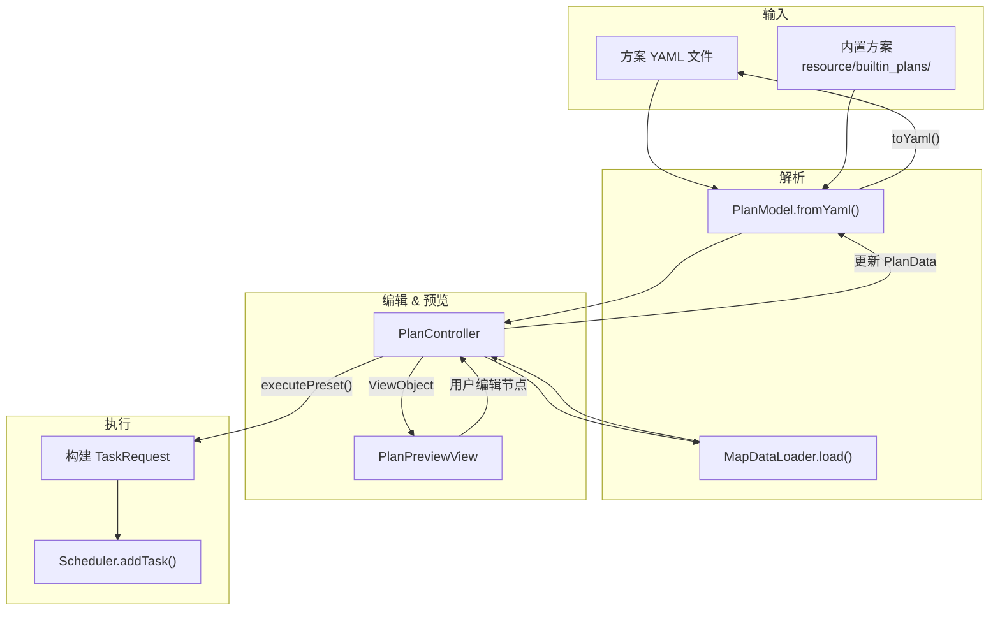

# 出击计划系统

> 涉及文件：`src/model/PlanModel.ts` · `src/controller/plan/`（PlanController · importExport · presetFlow · nodeEditor · rendering）· `src/view/plan/`（PlanPreviewView(Facade) · MapView · NodeEditorView · FleetPresetView · FleetEditDialog）· `src/model/MapDataLoader.ts` · `src/types/model.ts` · `resource/builtin_plans/` · `resource/maps/`

## 概述

出击计划（Plan）是 AutoWSGR-GUI 的核心数据结构，定义了一次战斗出击的完整策略：打哪张地图、经过哪些节点、每个节点用什么阵型、是否夜战、迂回规则、修理策略等。

计划以 YAML 文件存储，可通过 GUI 的可视化地图编辑器进行查看和修改。

---

## 数据结构

### PlanData — 方案主体

```typescript
interface PlanData {
  chapter: number;          // 章节号
  map: number;              // 地图号
  selected_nodes: string[]; // 选中的节点列表，如 ["A", "D", "G", "H"]
  fight_condition?: 1|2|3|4|5;  // 出击条件
  repair_mode?: number | number[]; // 修理策略（单值或按舰位数组）
  fleet_id?: number;        // 编队号 (1-4)
  node_defaults?: NodeArgs; // 节点默认参数
  node_args?: Record<string, NodeArgs>; // 按节点覆盖的参数
  fleet_presets?: FleetPreset[];  // 内嵌的编队预设
  times?: number;           // 执行次数
  stop_condition?: StopCondition; // 停止条件
}
```

### NodeArgs — 节点参数

```typescript
interface NodeArgs {
  formation?: 1|2|3|4|5;   // 阵型
  night?: boolean;          // 是否夜战
  proceed?: boolean;        // 是否继续前进
  enemy_rules?: [string, string|number][];  // 索敌规则
}
```

**阵型映射**：`1=单纵阵` `2=复纵阵` `3=轮形阵` `4=梯形阵` `5=单横阵`

**出击条件**：`1=稳步前进` `2=火力万岁` `3=全速前进` `4=跛行前进` `5=连续作战`

**索敌规则**示例：
```yaml
enemy_rules:
  - [AP >= 1, 4]      # 有补给舰 → 梯形阵
  - [AP < 1, detour]   # 无补给舰 → 迂回
```

### FleetPreset — 编队预设

```typescript
interface FleetPreset {
  name: string;
  ships: (string | ShipFilter)[];  // 6 个舰位：具体舰名或模糊筛选
}

interface ShipFilter {
  nation?: string;     // 国籍筛选
  ship_type?: string;  // 舰型筛选
}
```

编队预设支持**具体舰名**（如 `"85工程"`）和**模糊筛选**（如 `{nation: "苏联", ship_type: "dd"}`），后者在执行时由 `resolveFleetPreset()` 解析为实际舰船。

---

## YAML 示例

```yaml
# 捞胖次 9-2
chapter: 9
map: 2
selected_nodes: [A, D, G, H, M, O, E, K]
fight_condition: 1
repair_mode: 2
fleet_id: 1
node_defaults:
  formation: 4
  night: false
  proceed: true
node_args:
  A:
    enemy_rules:
      - [AP >= 1, 4]
      - [AP < 1, detour]
fleet_presets:
  - name: 三响岛风
    ships: [85工程, AIII, 岛风, 科罗廖夫, 列宁格勒, 伏尔加格勒]
```

---

## 方案类型

| 类型 | `task_type` | 说明 |
|------|-------------|------|
| 常规出击 | 无 / `normal_fight` | 标准章节出击 |
| 战役 | `campaign` | 战役任务 |
| 演习 | `exercise` | 自动演习 |
| 决战 | `decisive` | 决战模式，含 `level1` / `level2` 目标舰队 |
| 活动 | `event_fight` | 活动地图出击 |

---

## 核心组件

### PlanModel — 方案解析器

| 方法 | 说明 |
|------|------|
| `fromYaml(yamlStr)` | 解析 YAML → `PlanData` 对象 |
| `toYaml(plan)` | 序列化 `PlanData` → YAML 字符串 |
| `getNodeArgs(plan, node)` | 获取指定节点的合并后参数（node_args 覆盖 node_defaults） |
| `mergeFleetPreset(plan, presetIndex)` | 将编队预设合并到方案的 fleet_id 中 |

### MapDataLoader — 地图数据加载

地图 JSON 存放在 `resource/maps/` 目录，包含节点坐标、类型、连线等信息。

| 方法 | 说明 |
|------|------|
| `load(chapter, map)` | 通过 IPC 加载地图 JSON，返回 `MapData`，结果缓存 |
| `loadEx(chapter)` | 加载 Ex 章节地图 |

```typescript
interface MapData {
  nodes: MapNode[];   // 节点列表
  edges: MapEdge[];   // 连线列表
}

interface MapNode {
  id: string;         // 节点标识，如 "A", "B"
  x: number;          // 坐标 X
  y: number;          // 坐标 Y
  type: string;       // 节点类型（战斗、资源、Boss）
  detour?: boolean;   // 是否可迂回
  night?: boolean;    // 是否夜战节点
}
```

### PlanController — 方案控制器

方案控制器位于 `src/controller/plan/`，拆分为多个模块：

| 文件 | 职责 |
|------|------|
| `PlanController.ts` | 主控制器：持有当前方案状态，协调下属模块 |
| `importExport.ts` | 方案文件的导入/导出/新建流程 |
| `presetFlow.ts` | 任务预设的导入/查看/关闭/执行流程 |
| `nodeEditor.ts` | 从 UI 收集节点阵型/夜战/索敌规则并写回 PlanData |
| `rendering.ts` | 构建 `PlanPreviewViewObject`，协调地图数据和方案数据的合并 |

### PlanPreviewView — 方案预览视图 (Facade)

`PlanPreviewView` 作为 Facade 持有三个子视图，Controller 只与 Facade 交互：

| 子视图 | 文件 | 职责 |
|--------|------|------|
| `MapView` | `view/plan/MapView.ts` | 地图节点/连线渲染、节点类型图标/名称常量 |
| `NodeEditorView` | `view/plan/NodeEditorView.ts` | 节点详细编辑器（阵形、夜战、继续条件） |
| `FleetPresetView` | `view/plan/FleetPresetView.ts` | 编队预设列表管理（添加、编辑、删除） |
| `FleetEditDialog` | `view/plan/FleetEditDialog.ts` | 编队预设编辑弹窗（支持舰船自动补全） |

---

## 数据流



---

## 内置方案

`resource/builtin_plans/` 包含 18 个预制方案：

| 分类 | 数量 | 示例 |
|------|------|------|
| 周常 | 11 | `周常1章-1-2.yaml` ~ `周常9章-9-2.yaml` |
| 捞胖次 | 4 | `捞胖次9-2.yaml`, `捞胖次7-4.yaml` |
| 战役 | 1 | `战役.yaml` |
| 演习 | 1 | `自动演习.yaml` |
| 决战 | 1 | `决战.yaml` |

---

## 与其他系统的关系

- **任务调度**：方案通过 `controller/plan/presetFlow.ts` 的 `executePresetFlow()` 构建 `TaskRequest` 后交给 `Scheduler`
- **模板与任务组**：模板的 `planPaths` 引用方案文件；任务组 item 可以是 `kind: "plan"` 类型
- **配置系统**：方案中的 `fleet_id` 和 `repair_mode` 可被配置页覆盖
- **共享组件**：`view/shared/ShipAutocomplete.ts` 提供舰船名自动补全，被 `FleetEditDialog` 使用
