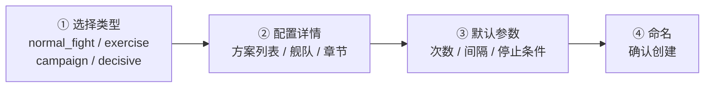
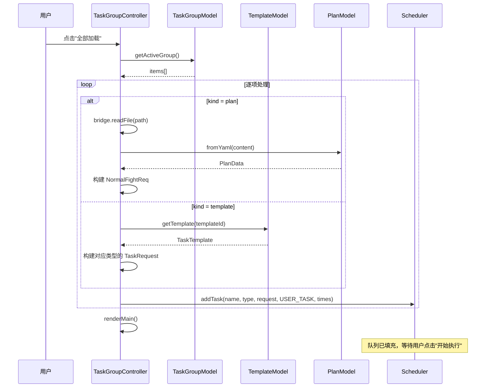

# 模板与任务组

> 涉及文件：`src/model/TemplateModel.ts` · `src/controller/template/`（TemplateController · wizard · useTemplate · selectors · crud）· `src/model/TaskGroupModel.ts` · `src/controller/taskGroup/`（TaskGroupController · addItems · queueLoader · metaLoader · contextMenu · importExport）· `src/view/template/`（TemplateLibraryView · TemplateWizardView · SelectorDialog）· `src/view/taskGroup/TaskGroupView.ts` · `src/view/shared/ShipAutocomplete.ts` · `resource/builtin_templates.json` · `templates/templates.json` · `task_groups.json`

## 概述

模板和任务组共同构成 AutoWSGR-GUI 的**任务组织层**：

- **模板 (Template)**：定义"怎么打"——一种可复用的任务配置，包含任务类型、方案路径、停止条件等
- **任务组 (Task Group)**：定义"打哪些"——由多个任务项组成的有序列表，可一键加载到调度队列

```
模板库 ──(引用)──→ 任务组 ──(加载)──→ 调度队列
                     ↑
               方案文件也可直接加入
```

---

## 模板系统

### 模板类型

| 类型 | `type` 值 | 说明 |
|------|-----------|------|
| 常规出击 | `normal_fight` | 包含一到多个方案路径 (`planPaths`) |
| 演习 | `exercise` | 指定舰队 ID |
| 战役 | `campaign` | 战役类型名 |
| 决战 | `decisive` | 章节号 + 目标舰列表 |

### 模板结构

```typescript
interface TaskTemplate {
  id: string;                    // 唯一标识
  name: string;                  // 显示名称
  type: TemplateType;            // normal_fight | exercise | campaign | decisive
  builtin: boolean;              // 是否内置
  planPaths?: string[];          // 方案文件列表（常规出击）
  defaultTimes: number;          // 默认执行次数
  defaultStopCondition?: StopCondition;
  fleet_id?: number;             // 演习用舰队
  chapter?: number;              // 决战章节
  level1?: string[];             // 决战第一阶段目标舰
  level2?: string[];             // 决战第二阶段目标舰
  flagship_priority?: string[];  // 旗舰优先级
}
```

### 存储

| 来源 | 文件 | 可写 |
|------|------|------|
| **内置** | `resource/builtin_templates.json` | 只读 |
| **用户** | `templates/templates.json` | 可读写 |

`TemplateModel.init()` 在启动时合并两个来源，内置模板的 `builtin: true` 标识确保不可删除。

### 内置模板

| ID | 名称 | 说明 |
|----|------|------|
| `builtin_farm_loot` | 刷胖次 | 4 个方案路径可选，`stopCondition: {loot_count_ge: 50}` |
| `builtin_weekly` | 周常任务 | 11 个章节方案 |
| `builtin_exercise` | 自动演习 | 舰队 ID 可配置 |
| `builtin_campaign` | 战役 | 战役类型任务 |
| `builtin_decisive` | 决战 | 决战模式 |

### 创建向导

向导逻辑位于 `controller/template/wizard.ts`，`TemplateController` 协调调用，视图由 `TemplateWizardView`（`view/template/TemplateWizardView.ts`）渲染：



### 模板视图

模板视图位于 `src/view/template/`，拆分为三个组件：

| 组件 | 文件 | 职责 |
|--------|------|------|
| `TemplateLibraryView` | `TemplateLibraryView.ts` | 模板库卡片列表渲染（纯渲染，通过回调通知 Controller） |
| `TemplateWizardView` | `TemplateWizardView.ts` | 创建向导多步骤表单（含舰船自动补全） |
| `SelectorDialog` | `SelectorDialog.ts` | 通用选择器弹窗（单选/多选方案、战役、舰队等） |

---

## 任务组系统

### 数据结构

```typescript
// task_groups.json 结构
{
  activeGroup: string;      // 当前激活的组名
  groups: TaskGroup[];
}

interface TaskGroup {
  name: string;             // 组名
  items: TaskGroupItem[];   // 有序任务项列表
}

interface TaskGroupItem {
  kind: 'plan' | 'template';    // 类型
  path?: string;                 // 方案文件路径（kind=plan）
  templateId?: string;           // 模板 ID（kind=template）
  times: number;                 // 执行次数
  label: string;                 // 显示标签
  fleetPresetIndex?: number;     // 可选的编队预设覆盖
}
```

### 持久化

`TaskGroupModel` 通过 IPC 读写 `task_groups.json`：

| 方法 | 说明 |
|------|------|
| `load()` | 从文件加载所有组 |
| `save()` | 写回文件（在 `beforeunload` 时自动调用） |
| `addGroup(name)` | 新建空组 |
| `removeGroup(name)` | 删除组 |
| `renameGroup(old, new)` | 重命名 |
| `addItem(groupName, item)` | 添加任务项 |
| `removeItem(groupName, index)` | 移除任务项 |
| `reorderItem(groupName, from, to)` | 拖拽重排 |

### TaskGroupView — 任务组视图

UI 包含：
- **组选择器**：下拉菜单 + 新建/重命名/删除按钮
- **任务列表**：每项显示名称、次数、类型标签
- **操作**：
  - 拖拽排序
  - 右键上下文菜单（编辑/删除/复制）
  - "全部加载到队列" / "单项加载" 按钮
  - 任务组导入/导出

---

## 任务组控制器

任务组控制器位于 `src/controller/taskGroup/`，拆分为多个模块：

| 文件 | 职责 |
|------|------|
| `TaskGroupController.ts` | 主控制器：绑定视图事件，协调下属模块 |
| `addItems.ts` | 向任务组添加项目：从当前方案/文件/预设添加 |
| `queueLoader.ts` | 加载任务组到调度队列：逐项构建 TaskRequest → `Scheduler.addTask()` |
| `metaLoader.ts` | 加载任务项元数据（方案标题、模板名称） |
| `contextMenu.ts` | 右键上下文菜单：编辑/删除/复制任务项 |
| `importExport.ts` | 任务组的导入/导出 |

---

## 加载到调度队列

从任务组加载任务到 `Scheduler` 的流程：



---

## 与其他系统的关系

- **出击计划**：`kind: "plan"` 类型的任务项直接引用方案 YAML 文件
- **任务调度**：加载后的任务以 `USER_TASK` 优先级进入 `Scheduler` 队列
- **配置系统**：`CronScheduler` 的 `autoNormalFight` 开关可以自动执行当前活跃任务组
- **后端通信**：模板中的配置最终被构建为 `TaskRequest`，通过 `ApiClient` 发送到后端
