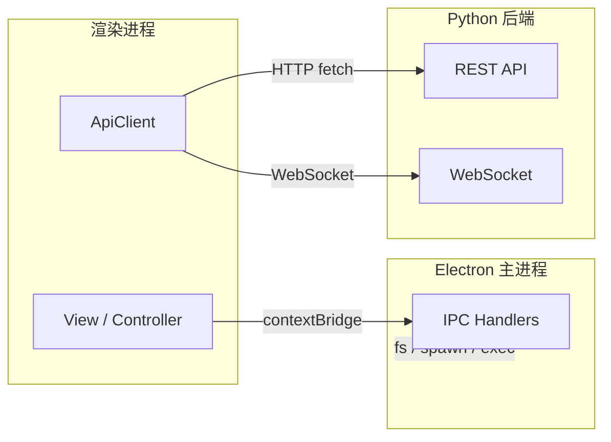
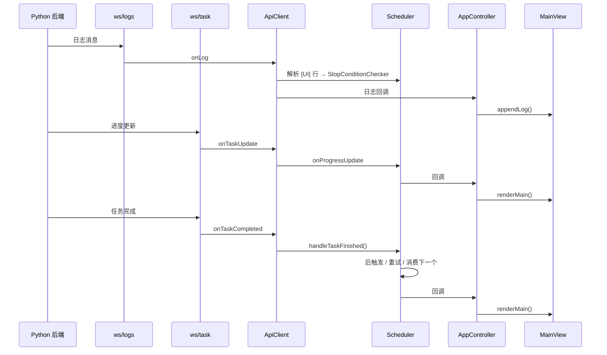

# 后端通信

> 涉及文件：`electron/preload.ts` · `electron/main.ts`（IPC handlers）· `src/model/ApiClient.ts` · `src/types/api.ts` · `src/types/electronBridge.ts`

## 概述

AutoWSGR-GUI 的通信分为**两层**：



| 层 | 路径 | 用途 |
|----|------|------|
| **IPC** | 渲染进程 ↔ Electron 主进程 | 文件 I/O、系统对话框、环境管理、后端进程控制 |
| **HTTP/WS** | 渲染进程 ↔ Python 后端 | 游戏操作、任务执行、实时日志 |

---

## IPC 通信层

### 暴露机制

`preload.ts` 通过 Electron 的 `contextBridge.exposeInMainWorld()` 安全地将 IPC 方法暴露到 `window.electronBridge` 对象上。渲染进程只能通过预定义的方法调用主进程，无法直接访问 Node.js API。

### API 分类

#### 文件操作

| 方法 | 参数 | 返回 | 说明 |
|------|------|------|------|
| `readFile(path)` | 文件路径 | `string` | 读取文件内容 |
| `saveFile(path, content)` | 路径 + 内容 | `void` | 写入文件 |
| `appendFile(path, content)` | 路径 + 内容 | `void` | 追加内容 |
| `openFileDialog(filters, defaultDir?)` | 文件过滤器 | `{path, content} \| null` | 打开文件选择对话框 |
| `saveFileDialog(name, content, filters)` | 默认名 + 内容 | `string \| null` | 保存文件对话框 |
| `openDirectoryDialog(title?)` | 对话框标题 | `string \| null` | 文件夹选择 |

#### 路径查询

| 方法 | 返回 | 说明 |
|------|------|------|
| `getAppRoot()` | `string` | 应用工作目录 |
| `getPlansDir()` | `string` | 方案文件目录 |
| `getConfigDir()` | `string` | 配置文件目录 |
| `listPlanFiles()` | `{name, file}[]` | 列出方案文件 |
| `openFolder(path)` | `void` | 在资源管理器中打开 |

#### 环境管理

| 方法 | 返回 | 说明 |
|------|------|------|
| `checkEnvironment()` | `{pythonCmd, pythonVersion, missingPackages, allReady}` | 检查 Python 环境 |
| `installDeps()` | `{success, output}` | 安装 Python 依赖 |
| `installPortablePython()` | `{success}` | 安装便携版 Python |
| `checkUpdates()` | `{gitAvailable, hasUpdates, ...}` | 检测 autowsgr 库更新 |
| `pullUpdates()` | `{success, output}` | 拉取更新 |

#### Python 路径配置

| 方法 | 说明 |
|------|------|
| `getPythonPath()` | 同步获取用户配置的 Python 路径（`null` = 自动检测） |
| `setPythonPath(path)` | 设置 Python 路径并清除缓存 |
| `validatePython(path)` | 验证指定路径的 Python 版本是否兼容 |

#### 后端控制

| 方法 | 说明 |
|------|------|
| `startBackend()` | 启动 Python 后端子进程 |
| `detectEmulator()` | 自动检测模拟器 |
| `checkAdbDevices()` | 查询 ADB 设备列表 |
| `runSetup()` | 运行 setup.bat 脚本 |

#### GUI 自动更新

| 方法 | 说明 |
|------|------|
| `checkGuiUpdates()` | 检查 GUI 应用更新 |
| `downloadGuiUpdate()` | 下载更新包 |
| `installGuiUpdate()` | 安装更新并重启 |
| `onUpdateStatus(callback)` | 监听更新状态变化 |

#### 事件监听

| 方法 | 事件 | 说明 |
|------|------|------|
| `onBackendLog(callback)` | `backend-log` | 接收 Python 后端日志 |
| `onSetupLog(callback)` | `setup-log` | 接收 setup.bat 输出 |

#### 同步方法

| 方法 | 说明 |
|------|------|
| `getAppVersion()` | 同步获取应用版本号 |
| `getBackendPort()` | 同步获取后端端口 |
| `setBackendPort(port)` | 设置后端端口 |

---

## HTTP REST API

`ApiClient` 封装与 Python 后端的所有 HTTP 通信。

### 基础配置

- 默认地址：`http://localhost:8438`
- 端口可通过 `gui_settings.json` 配置
- 所有请求/响应使用 JSON 格式

### 统一响应结构

```typescript
interface ApiResponse<T = unknown> {
  success: boolean;
  data?: T;
  message?: string;
  error?: string;
}
```

### 端点列表

#### 系统管理

| 方法 | 端点 | 超时 | 说明 |
|------|------|------|------|
| POST | `/api/system/start` | 300s | 连接模拟器 + 启动游戏 |
| POST | `/api/system/stop` | - | 断开连接 |
| GET | `/api/system/status` | - | 系统状态查询 |
| GET | `/api/system/emulator/devices` | 15s | ADB 设备列表 |

#### 任务执行

| 方法 | 端点 | Body | 说明 |
|------|------|------|------|
| POST | `/api/task/start` | `TaskRequest` | 启动战斗/演习/战役/决战 |
| POST | `/api/task/stop` | - | 停止当前任务 |
| GET | `/api/task/status` | - | 当前任务状态 |

`TaskRequest` 为联合类型，支持 5 种任务：

```typescript
type TaskRequest =
  | NormalFightReq   // {type: 'normal_fight', plan, times, gap}
  | EventFightReq    // {type: 'event_fight', plan, times}
  | CampaignReq      // {type: 'campaign', campaign_name, times}
  | ExerciseReq      // {type: 'exercise', fleet_id}
  | DecisiveReq      // {type: 'decisive', chapter, level1, level2}
```

#### 远征

| 方法 | 端点 | 说明 |
|------|------|------|
| POST | `/api/expedition/check` | 收取所有已完成的远征 |

#### 游戏状态

| 方法 | 端点 | 返回数据 | 说明 |
|------|------|----------|------|
| GET | `/api/game/context` | 编队/资源/远征/建造槽 | 全局游戏状态 |
| GET | `/api/game/acquisition` | 战利品/舰船 OCR 数量 | 出征面板读数 |

#### 操作端点

| 方法 | 端点 | 说明 |
|------|------|------|
| POST | `/api/build/collect` | 收取建造 |
| POST | `/api/build/start` | 开始建造 |
| POST | `/api/reward/collect` | 收取每日奖励 |
| POST | `/api/cook` | 食堂烹饪 |
| POST | `/api/repair/bath` | 浴室快速修理 |
| POST | `/api/repair/ship` | 单船泡澡修理 |
| POST | `/api/destroy` | 解体舰船 |

#### 健康检查

| 方法 | 端点 | 说明 |
|------|------|------|
| GET | `/api/health` | 后端健康状态、运行时间 |

---

## WebSocket 通信

`ApiClient` 维护两条 WebSocket 连接，支持断线自动重连（3 秒延迟）：

### 连接

| 路径 | 用途 |
|------|------|
| `ws://localhost:8438/ws/logs` | 实时日志流 |
| `ws://localhost:8438/ws/task` | 任务进度 + 完成通知 |

### 消息类型

```typescript
// 日志消息 (/ws/logs)
interface WsLogMessage {
  type: 'log';
  timestamp: string;
  level: string;
  channel: string;
  message: string;
}

// 任务进度更新 (/ws/task)
interface WsTaskUpdate {
  type: 'task_update';
  task_id: string;
  status: string;
  progress?: { current: number; total: number; node: string | null };
}

// 任务完成 (/ws/task)
interface WsTaskCompleted {
  type: 'task_completed';
  task_id: string;
  success: boolean;
  result?: TaskResult;
  error?: string;
}
```

### 数据流



---

## 与其他系统的关系

- **任务调度**：`Scheduler` 持有 `ApiClient` 实例，通过 REST API 发起/停止任务，通过 WebSocket 接收进度和完成通知
- **配置系统**：`backend_port` 配置决定 `ApiClient` 的连接地址
- **环境管理**：所有环境相关操作（Python 检测/安装、后端启停）通过 IPC 层完成
- **出击计划**：方案数据被构建为 `CombatPlanReq` 嵌入 `TaskRequest` 中
