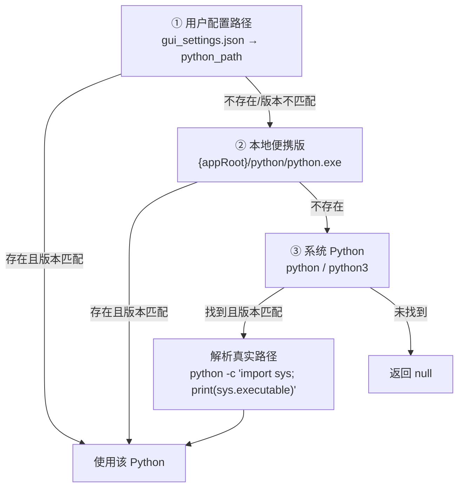
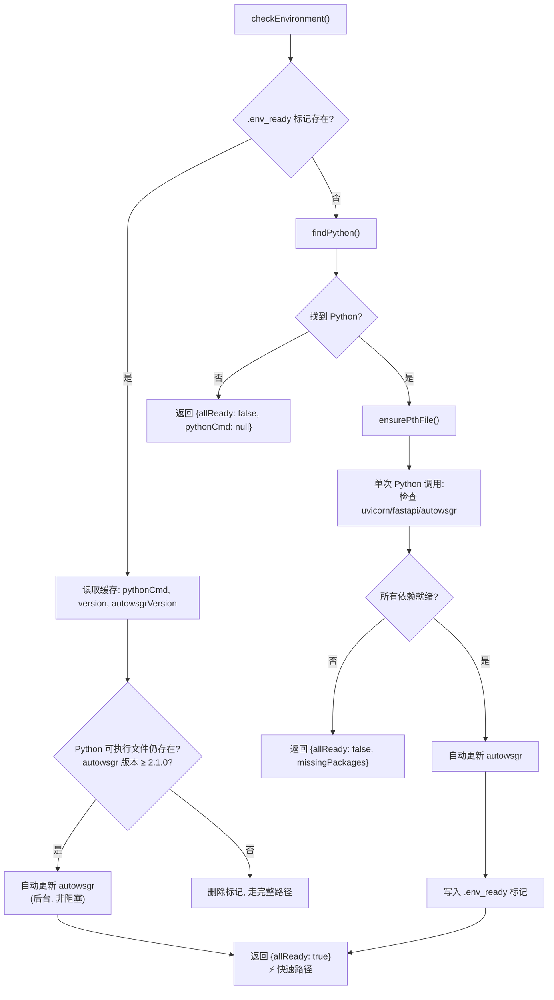
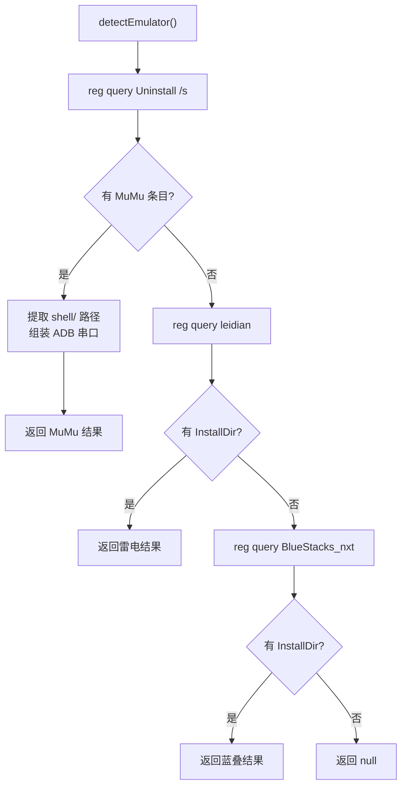
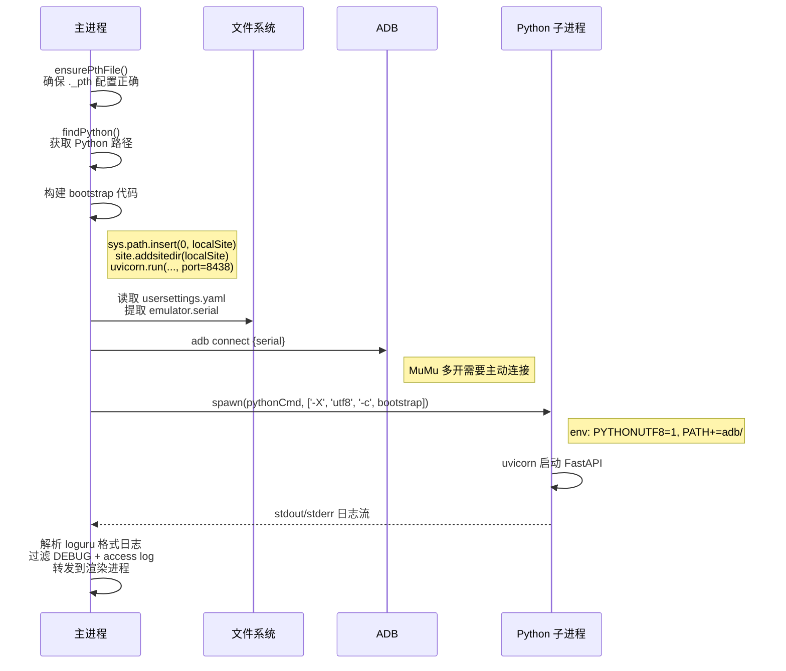
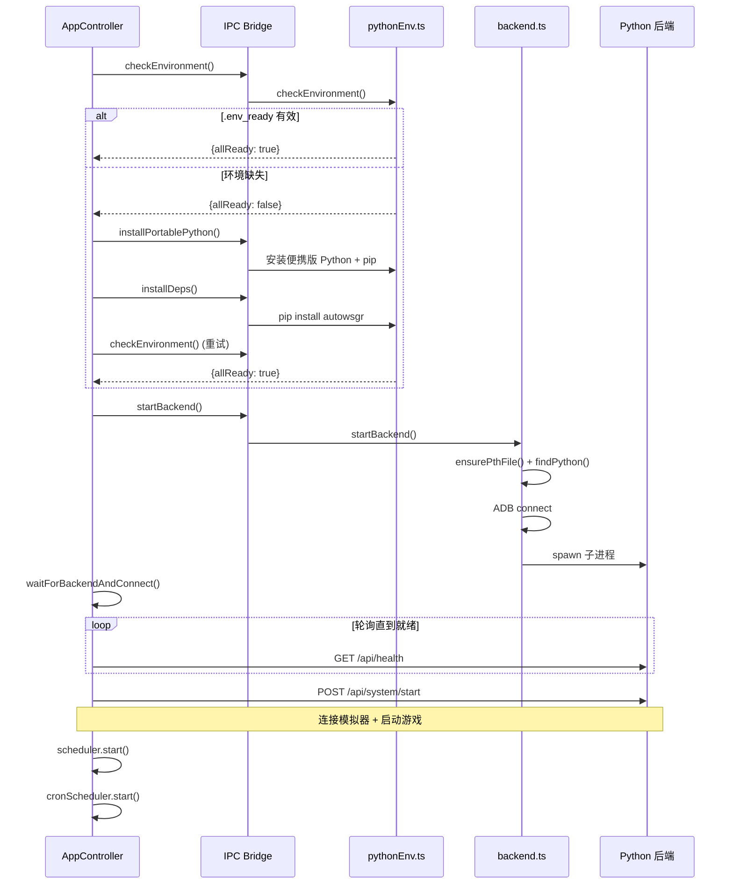

# 环境管理

> 涉及文件：`electron/pythonEnv/`（context · finder · envCheck · installer · updater · utils）· `electron/emulatorDetect.ts` · `electron/backend.ts` · `electron/main.ts`

## 概述

环境管理负责三个核心任务：

1. **Python 环境**：发现/安装/验证 Python，管理依赖包
2. **模拟器检测**：通过 Windows 注册表自动识别已安装的模拟器
3. **后端生命周期**：启动/停止 Python 后端子进程

---

## Python 环境管理

Python 环境管理位于 `electron/pythonEnv/` 子目录，采用依赖注入模式，通过 `index.ts` 聚合导出：

| 文件 | 职责 |
|------|------|
| `context.ts` | 共享上下文与缓存状态（`PythonEnvContext` 接口、缓存变量） |
| `finder.ts` | Python 可执行文件发现（用户配置 → 便携版 → 系统全局） |
| `envCheck.ts` | 环境验证主流程（VC++ Redistributable 检查、标记文件管理、依赖包验证） |
| `installer.ts` | Python 安装与依赖管理（pip 设置、autowsgr 安装） |
| `updater.ts` | autowsgr 自动更新逻辑（PyPI 版本检查 + 升级） |
| `utils.ts` | 工具函数与共享接口（路径工具、环境变量、pip 命令、.pth 文件处理） |
| `index.ts` | 聚合导出 |

### 发现优先级

`finder.ts` 中的 `findPython()` 按以下顺序查找可用的 Python：



**版本要求**：仅接受 Python **3.12** 或 **3.13**。

**Shim 解析**：pyenv 等工具使用 `.bat` shim 文件，Node.js `spawn()` 无法直接执行。通过 Python 自身的 `sys.executable` 获取真实 `.exe` 路径。

**缓存**：发现结果缓存在 `context.ts` 的 `PythonEnvContext` 中，用户切换路径时调用 `clearPythonCache()` 清除。

### 便携版 Python

应用打包时内置 Python 3.12.8 embed 发行版，位于 `{appRoot}/python/`。

**安装流程** (`installer.ts` 中的 `installPortablePython()`):
1. 检查 `python/python.exe` 是否存在
2. 若存在：确保 `._pth` 配置正确 → 检查 pip → 安装 pip（如缺失）
3. 若不存在：在线下载 Python embed zip → 解压 → 安装 pip

**PTH 文件处理** (`utils.ts` 中的 `ensurePthFile()`):
- Python embed 版默认禁用 `import site`
- 此函数取消注释 `python312._pth` 中的 `import site` 行
- 添加 `site-packages` 路径条目
- 使 `site.addsitedir()` 可用于加载 `.pth` 文件

### 环境检查

`envCheck.ts` 中的 `checkEnvironment()` 检测 Python 和依赖包是否就绪，并包含 VC++ Redistributable 检查：



### .env_ready 标记文件

缓存环境状态，避免每次启动的重复检查：

```json
{
  "pythonCmd": "C:\\path\\to\\python.exe",
  "pythonVersion": "Python 3.12.8",
  "autowsgrVersion": "2.1.9"
}
```

- **路径**：`{appRoot}/.env_ready`
- **失效时机**：安装依赖后删除、Python 路径配置变更后删除
- **验证条件**：Python 文件存在 + autowsgr 版本 ≥ 2.1.0

### 依赖安装

`installer.ts` 中的 `installDependencies()`:
1. 删除 `.env_ready` 标记
2. 确保 pip 可用 (`ensurePip()`)
3. 安装到本地目录：
   ```
   pip install --target {appRoot}/python/site-packages --upgrade setuptools autowsgr
   ```

**所有包安装到 `{appRoot}/python/site-packages/`**，不影响全局 Python 环境。

### 自动更新

`updater.ts` 中的 `checkForUpdates()` 在每次启动环境检查通过后自动执行：
1. 单次 Python 调用：获取本地 autowsgr 版本 + PyPI 最新版本
2. 若有新版：`pip install --target ... --upgrade autowsgr`
3. 清理旧 `.dist-info` 目录避免版本检测错误
4. 验证升级：重新检查 autowsgr 版本 + 关键依赖

---

## 模拟器检测

`detectEmulator()` 通过 Windows 注册表自动识别已安装的模拟器：

### 支持的模拟器

| 模拟器 | 检测方式 | 默认 ADB 串口 |
|--------|----------|---------------|
| **MuMu 12** | 注册表 `Uninstall` 项的 `UninstallString` | `127.0.0.1:16384` |
| **雷电 (LDPlayer)** | 注册表 `HKLM\SOFTWARE\leidian\InstallDir` | `127.0.0.1:5555` |
| **BlueStacks** | 注册表 `HKLM\SOFTWARE\BlueStacks_nxt*\InstallDir` | `127.0.0.1:5555` |

### 返回结构

```typescript
interface EmulatorDetectResult {
  type: string;     // "MuMu" | "雷电" | "蓝叠"
  path: string;     // 模拟器安装路径
  serial: string;   // ADB 连接串口
  adbPath: string;  // 模拟器自带的 ADB 路径
}
```

### 检测流程



---

## 后端生命周期

### 启动流程

`startBackend()` (`electron/backend.ts`) 负责启动 Python 后端：



### 启动参数

| 参数 | 说明 |
|------|------|
| `-X utf8` | 启用 UTF-8 模式 |
| `-c bootstrap` | 内联 Python 代码（注入 site-packages 路径 + 启动 uvicorn） |

### 环境变量

| 变量 | 值 | 说明 |
|------|-----|------|
| `PYTHONUTF8` | `1` | 强制 UTF-8 编码 |
| `PYTHONIOENCODING` | `utf-8` | I/O 编码 |
| `PATH` | 原始 PATH + `{appRoot}/adb/` | 内置 ADB 可被后端发现 |

### 日志转发

后端 stdout/stderr 输出经过处理后转发到渲染进程：
1. 按 loguru 格式（`HH:mm:ss.SSS | LEVEL | module | message`）识别新日志行
2. 过滤掉 `DEBUG` 级别日志及其多行续行
3. 过滤掉 uvicorn access log（`GET /api/...` 格式）
4. 通过 `mainWindow.webContents.send('backend-log', line)` 转发

### 停止

`stopBackend()` 直接 `kill()` 子进程。应用退出时 (`app.on('before-quit')`) 自动调用。

---

## 启动时序（完整视角）



---

## 与其他系统的关系

- **配置系统**：`gui_settings.json` 的 `python_path` 影响 Python 发现优先级；`backend_port` 决定 uvicorn 监听端口
- **后端通信**：`startBackend()` 的成功是 `ApiClient` 能连接的前提
- **任务调度**：`Scheduler.start()` 在后端就绪后调用 `POST /api/system/start` 完成最终连接
