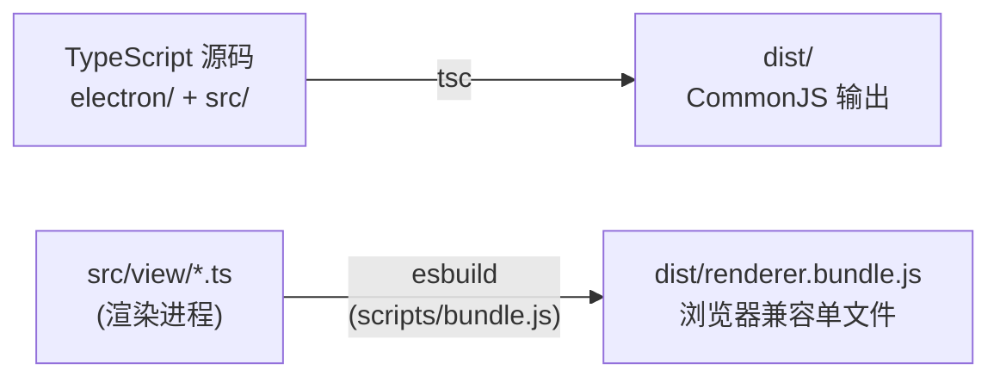

# 开发环境搭建

> 涉及文件：`package.json` · `tsconfig.json` · `scripts/` · `build/installer.nsh`

## 前置要求

| 工具 | 版本 | 说明 |
|------|------|------|
| **Node.js** | 18+ | 推荐使用 LTS 版本 |
| **Python** | 3.12 / 3.13 | 用于运行 AutoWSGR 后端 |
| **模拟器** | MuMu 12 / 雷电 / 蓝叠 | 运行战舰少女R |

---

## 快速开始

```powershell
# 1. 克隆仓库
git clone https://github.com/yltx/AutoWSGR-GUI.git
cd AutoWSGR-GUI

# 2. 安装 Node 依赖
npm install

# 3. 开发模式运行
npm run dev
```

---

## NPM Scripts

| 命令 | 说明 |
|------|------|
| `npm run dev` | 编译 TypeScript + esbuild 打包 + 启动 Electron（开发日常使用） |
| `npm run build` | 仅编译（`tsc` + `esbuild`），不运行 |
| `npm start` | 等同于 `build` + `electron .`（含 chcp 65001） |
| `npm run dist` | 完整打包：下载 Python + ADB → 编译 → electron-builder NSIS 安装包 |
| `npm run pack` | 编译 + `electron-builder --dir`（生成目录，不打安装包） |
| `npm run prepare-python` | 单独下载便携版 Python |
| `npm run prepare-adb` | 单独下载 ADB 工具 |

---

## 构建流程

### 编译管线



- **tsc**：将所有 TypeScript 编译到 `dist/` 目录（主进程 + 渲染进程）
- **esbuild**：将渲染进程代码打包为单个浏览器兼容的 `renderer.bundle.js`

### 构建脚本

#### `scripts/bundle.js`

用 esbuild 将 `src/` 下的渲染进程代码打包为 `dist/renderer.bundle.js`，配置 `platform: 'browser'`，排除 Node.js 内置模块。

#### `scripts/prepare-python.js`

下载 Python 3.12.8 embed 发行版，解压到 `python/` 目录。在 `npm run dist` 时自动调用。

#### `scripts/prepare-adb.js`

下载 Android Platform-Tools（含 `adb.exe`），解压到 `adb/` 目录。在 `npm run dist` 时自动调用。

---

## 打包配置

### electron-builder

打包配置在 `package.json` 的 `build` 字段中：

```json
{
  "appId": "com.autowsgr.gui",
  "productName": "AutoWSGR-GUI",
  "directories": { "output": "release" },
  "files": ["dist/**/*", "src/view/**/*", "scripts/**/*"],
  "extraResources": [
    { "from": "resource", "to": "resource" },
    { "from": "plans", "to": "plans" },
    { "from": "setup.bat", "to": "setup.bat" },
    { "from": "python", "to": "python" },
    { "from": "adb", "to": "adb" }
  ]
}
```

**打包目标**：Windows NSIS 安装包 (`release/AutoWSGR-GUI-Setup-x.x.x.exe`)

**包含内容**：
- `dist/` — 编译后的 JS
- `src/view/` — HTML/CSS
- `resource/` — 内置方案 + 模板 + 地图
- `python/` — 便携版 Python
- `adb/` — ADB 工具

### NSIS 自定义

`build/installer.nsh` 包含 NSIS 安装程序的自定义脚本（如安装向导页面定制）。

---

## 目录约定

| 目录 | 运行时 (开发) | 运行时 (打包) |
|------|--------------|--------------|
| `appRoot()` | 项目根目录 | `%LOCALAPPDATA%/autowsgr-gui/` 或安装目录 |
| `resourceRoot()` | 同 appRoot | `resources/` (extraResources) |
| `plans/` | 项目根 `plans/` | extraResources `plans/` |
| `python/` | 项目根 `python/` | extraResources `python/` |
| `adb/` | 项目根 `adb/` | extraResources `adb/` |
| `usersettings.yaml` | 项目根 | appRoot |
| `gui_settings.json` | 项目根 | appRoot |
| `task_groups.json` | 项目根 | appRoot |
| `templates/` | 项目根 | appRoot |

---

## 调试技巧

### 后端日志

- Python 后端使用 loguru 格式输出日志到 stdout
- 主进程控制台（终端 / VS Code Debug Console）可看到带颜色的原始日志
- 渲染进程日志面板可看到经过滤的 INFO 及以上级别日志
- 启用配置页的"调试模式"可在日志面板显示 DEBUG 级别

### IPC 调试

- `electronBridge` 对象在渲染进程 DevTools 控制台中可直接访问：
  ```javascript
  // 在 DevTools Console 中
  await window.electronBridge.checkEnvironment()
  await window.electronBridge.getAppRoot()
  ```

### 热重载

项目未配置 HMR。修改代码后需要：
1. 终止 Electron 进程
2. 运行 `npm run dev` 重新编译并启动

### 常见问题

| 问题 | 原因 | 解决 |
|------|------|------|
| Python 未找到 | 未安装 Python 3.12/3.13 或便携版缺失 | 运行 `npm run prepare-python` 或在配置页手动设置路径 |
| 后端启动失败 | autowsgr 未安装 | 通过 GUI 环境检查自动安装，或手动 `pip install autowsgr` |
| ADB 连接失败 | 模拟器串口不匹配 | 在配置页手动填写 ADB 串口 |
| 端口冲突 | 8438 端口被占用 | 在配置页更改后端端口 |
| TypeScript 编译错误 | 类型定义不匹配 | 确认 Node.js 类型版本与 `@types/node` 一致 |

---

## 技术栈一览

| 组件 | 技术 | 版本 |
|------|------|------|
| 桌面框架 | Electron | 33+ |
| 前端语言 | TypeScript | 5.6+ |
| 打包工具 | esbuild | 0.27+ |
| 安装包 | electron-builder (NSIS) | 26+ |
| 自动更新 | electron-updater | 6+ |
| YAML 解析 | js-yaml | 4+ |
| 样式预处理 | Sass (SCSS) | — |
| 后端框架 | Python FastAPI + uvicorn | — |
| 自动化核心 | autowsgr | 2.1.0+ |

---

## SCSS 样式架构

样式位于 `src/view/styles/`，采用三层组织：

```
styles/
├── main.scss              # 入口：@use 引入所有子模块
├── styles.css             # 编译产物
├── base/                  # 基础层
│   ├── _variables.scss    # CSS 变量、主题色、断点
│   └── _base.scss         # 全局重置、基础样式
├── components/            # 组件层（跨页面复用）
│   ├── _buttons.scss      # 按钮样式
│   ├── _forms.scss        # 表单控件
│   ├── _modal.scss        # 模态弹窗
│   ├── _nav.scss          # 导航栏
│   ├── _autocomplete.scss # 自动补全下拉
│   ├── _task-group.scss   # 任务组组件
│   └── _template.scss     # 模板卡片/向导
└── pages/                 # 页面层（特定页面布局）
    ├── _config.scss       # 配置页
    ├── main-page/         # 主页面
    │   ├── _index.scss    # 入口
    │   ├── _layout.scss   # 布局
    │   ├── _log.scss      # 日志面板
    │   └── _task-queue.scss # 任务队列
    └── plan/              # 方案编辑页
        ├── _index.scss    # 入口
        ├── _layout.scss   # 布局
        ├── _header.scss   # 头部
        ├── _node-map.scss # 地图节点
        ├── _node-types.scss # 节点类型图标
        ├── _node-editor.scss # 节点编辑器
        ├── _fleet-preset.scss # 编队预设
        └── _task-config.scss # 任务配置区域
```

**组织原则**：
- `base/`：全局变量和重置，晚于 `main.scss` 中最先 @use
- `components/`：跨页面复用的 UI 组件样式
- `pages/`：特定页面的布局和元素样式，复杂页面进一步拆分为子目录
